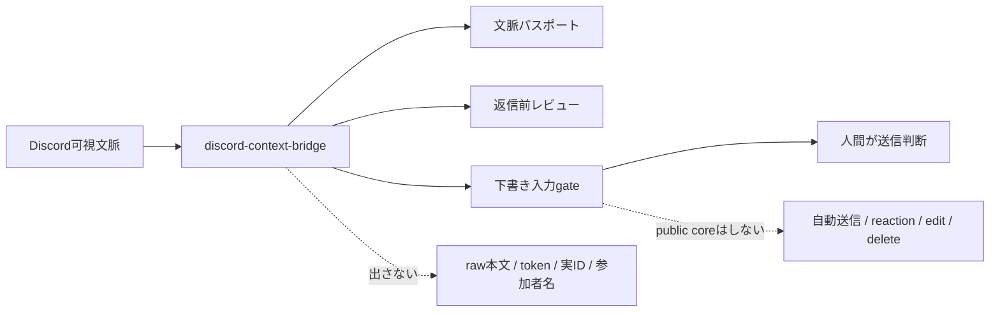
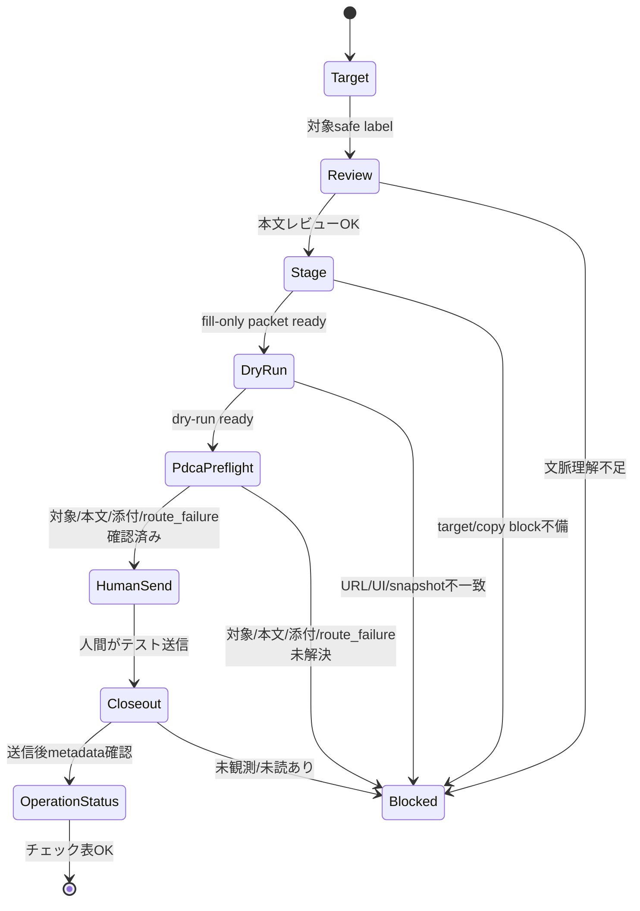

# Discord Context Bridge

Discord Context Bridge は、Discordで見えている会話を local-first に取り込み、
AIが安全に扱える文脈、返信前レビュー、送信直前の確認ログへ変換するための小さな橋です。

この public core は **Discordへ直接送信しません**。
既定は下書き入力までです。自動送信を使う場合は、private adapter 側で `auto-send-preflight` を通し、明示承認・宛先一致・idempotency・監査ログが揃った時だけ一回送信します。

## できること

| やりたいこと | 入口 |
|---|---|
| **見つけた対象を一気に取り込む（推奨）** | **`bridge-intake`** |
| 可視テキストを取り込む | `import-visible-text` |
| Bot REST API で履歴を private 保存する | `python scripts/discord_rest_backfill.py --url ... --json` |
| 文脈を整理する | `context-passport` |
| 返信前の最低文脈を確認する | `reply-context-plan` |
| 返信前に本文を確認する | `review-draft` / `guide-reply` |
| Discord URLの保存済みsnapshotを見る | `report-latest` / `coverage-report` |
| 下書き入力直前のgateを作る | `stage-discord-send` |
| Chrome fill-only のdry-runを確認する | `verify-chrome-fill-dry-run` |
| private adapter の自動送信許可を判定する | `auto-send-preflight` |
| 人間送信後の状態を閉じる | `closeout-discord-send` |
| 既存ログから送信テスト運転表を作る | `send-operation-status` |

## すぐ使う



message found 後の最短入口は `bridge-intake` です。URL と可視テキストを渡すと、snapshot 保存 → coverage → context passport →（任意）guide-reply までを 1 コマンドで進めます。stdout は metadata-only です。

```bash
PYTHONPATH=src python3 -m discord_context_bridge.cli \
  bridge-intake \
  --url 'https://discord.com/channels/<guild>/<channel>/<message>' \
  --input /path/to/visible-discord-text.txt \
  --draft "まず前提を確認してから返事します。" \
  --understanding-confirmed \
  --json
```

```bash
PYTHONPATH=src python3 -m discord_context_bridge.cli \
  import-visible-text \
  --input /path/to/visible-discord-text.txt \
  --guild example-community \
  --channel planning
```

```bash
PYTHONPATH=src python3 -m discord_context_bridge.cli \
  context-passport \
  --input /path/to/visible-discord-text.txt \
  --guild example-community \
  --channel planning
```

```bash
PYTHONPATH=src python3 -m discord_context_bridge.cli \
  review-draft \
  --understanding-confirmed \
  --draft "まず前提を確認してから返事します。"
```

## 送信テストの運転表

送信テストは次のチェック表で見ます。

1. 対象チャンネル/投稿先の明示
2. 送信本文のレビュー
3. dry-run または preview
4. 送信直前PDCA gate
5. テスト用チャンネルで人間が実送信
6. 送信ログ/失敗時回復の確認
7. 本番送信手順の固定化

自動送信を使う場合は、上の 1-3 に加えて `auto-send-preflight` を通します。`ready_for_auto_send_adapter` になるまで private adapter は実送信しません。

既存のgateログを吸い上げるには、`send-operation-status` を使います。



```bash
PYTHONPATH=src python3 -m discord_context_bridge.cli \
  send-operation-status \
  --staging-packet .local/discord-context-bridge/staging-packet.json \
  --dry-run-report .local/discord-context-bridge/fill-dry-run.json \
  --closeout-report .local/discord-context-bridge/send-closeout.json \
  --target-label test-channel \
  --rollback-plan-reviewed \
  --production-runbook-fixed \
  --json
```

詳しい手順は [docs/discord-send-operation-runbook.md](docs/discord-send-operation-runbook.md) を見てください。

## 保存モデル（append-only ledger）

履歴の正本は **append-only の観測台帳** です。最新レポートは正本ではなく projection です。

| 層 | 役割 | 例 |
|---|---|---|
| **ledger（正本）** | 可視テキストを読んだ観測を、重複でも 1 行ずつ追記する | private な `text-snapshots.ndjson` |
| **projection（派生）** | 台帳から「今見るべき最新状態」を組み立てる | `report-latest` / `coverage-report` |
| **digest（派生）** | 人が読む文脈・返信ガイド | `context-passport` / `guide-reply` / `bridge-intake` の metadata |

運用ルール:

- 同じ本文を再取得しても **保存を止めない**。差分は `content_hash` / `previous_content_hash` / `changed` / `duplicate_content` で表す。
- 各行は immutable event。訂正は既存行の上書きではなく、新しい observation として追記する。
- target 単位の順序は `stream_id` + `stream_sequence`。改ざん検知用に `previous_event_hash` / `event_hash` がある（外部公開証明ではない）。
- `report-latest` は live Discord を読まない。保存済み ledger だけを読む。

詳細は [docs/operating-contract.md](docs/operating-contract.md) と [docs/report-latest-architecture-context.md](docs/report-latest-architecture-context.md) を参照。

## 残TODO

active TODO の正本は [ISSUE_LIST.md](ISSUE_LIST.md) です。大きな流れは [ROADMAP.md](ROADMAP.md) にあります。
`docs/chat-context-*.md` や `docs/2026-07-01-*` は履歴証跡です。そこに書かれた「残務0」や open PR 数を現在状態として読まないでください。

今の最優先は次です。

- `bridge-intake` の運用定着と parser quality 指標（P1-3）。
- `core.py` と `test_core.py` を責務別に分け、速度と保守性を上げる。
- テスト用チャンネルでの人間送信 rehearsal は、人間承認と実ログ準備後に別実行する。

## 安全境界

- 基本言語は日本語です。ユーザーに見える説明、PR本文、運用メモは日本語で意味が分かる形にします。
- raw Discord text、参加者名、token、cookie、webhook、実ID、local absolute path を公開出力に含めません。
- Bot REST backfill は bot token 用の環境変数の存在だけを使い、token 値は出力・保存しません。
- Chrome profile から user token、cookie、localStorage を抽出して API に流用しません。
- public package は本文処理、metadata-only report、gate、closeout を担当します。
- Discord送信、reaction、edit、delete、repository visibility変更、外部投稿は、人間レビューと明示承認なしに実行しません。自動送信は private adapter 境界で `auto-send-preflight` が ready の時だけ許可します。
- `send_message()` は意図的に無効です。

## 運用チェック

```bash
python3 scripts/ops_check.py --profile fast
python3 scripts/ops_check.py --profile full
python3 scripts/repo_goal_status.py --run-smoke --json
python3 scripts/bump_version.py --check
```

runtime skill を更新したあと（または closeout 前）は、SSOT から再生成して local skill と揃えます。

```bash
python3 scripts/export_runtime_skills.py --json
# 生成物: dist/skills/<runtime>/SKILL.md を各 runtime の skills/discord-context-bridge/ へ配置
python3 scripts/verify_ssot_projection.py --json
python3 scripts/lint_runtime_skill_sync.py \
  --target claude-code="$HOME/.claude/skills/discord-context-bridge/SKILL.md" \
  --target codex="$HOME/.codex/skills/discord-context-bridge/SKILL.md" \
  --target grok="$HOME/.grok/skills/discord-context-bridge/SKILL.md" \
  --json
```

`generated_at` は `ssot_commit` の commit timestamp から決定し、同じ commit からの再生成で同じ値になります。
`verify_ssot_projection.py` は、`ssot_commit` に保存された manifest / contract と現在の checksum、`generated_at` を照合します。
commit hash の自己参照を避けるため、SSOT を変更する時は次の 2 段階にします。

1. `capability/manifest.yaml` / `docs/operating-contract.md` の変更を先に commit する。
2. その commit を指して runtime skill を再生成し、生成物を次の commit 候補にする。

`post-commit` からの自動生成・local runtime 更新は行いません。

local runtime skill の更新は既定で read-only です。同期を明示する場合だけ `--apply` を付けます。
`--apply` は1回につき1 targetだけを受け付け、symlinkを含む配置先や未登録runtimeは書き込み前に拒否します。

```bash
python3 scripts/sync_runtime_skills.py \
  --target claude-code="$HOME/.claude/skills/discord-context-bridge/SKILL.md" \
  --json
# 差分を確認し、人間レビュー後にだけ実行
python3 scripts/sync_runtime_skills.py \
  --target claude-code="$HOME/.claude/skills/discord-context-bridge/SKILL.md" \
  --apply \
  --json
```

hook は `post-commit` で自動同期しません。commit 後の worktree dirty 化と user runtime の意図しない変更を避けるためです。
必要な場合は `pre-push` から `verify_ssot_projection.py --json` と上記 read-only check だけを呼び、hook 有効化は別の明示承認で扱います。
local ops checkではClaude runtime skillを必須とし、CI環境だけ未配置をwarningとして許可します。存在するstale skillはCIでも失敗します。

PR前には次も確認します。

```bash
python3 scripts/gh_guard.py --json
python3 scripts/gh_pr_read.py --switch list
python3 scripts/pr_readiness_preflight.py --fetch --gh-switch --json
python3 scripts/pr_scope_guard.py --base origin/main --head HEAD --json
python3 scripts/boundary_logic_check.py --json
```

## 詳しい資料

- [docs/discord-send-operation-runbook.md](docs/discord-send-operation-runbook.md): 送信テスト運転表
- [docs/codex-chrome-extension-capability-inventory.md](docs/codex-chrome-extension-capability-inventory.md): Chrome拡張 fill-only 境界
- [docs/architecture-context-closeout.md](docs/architecture-context-closeout.md): closeoutの責務境界
- [docs/codex-discord-ingress.md](docs/codex-discord-ingress.md): Codexから読む時の入口
- [docs/full-reference.md](docs/full-reference.md): 以前の詳細README全文
- [references/initial-thread-ruleset.md](references/initial-thread-ruleset.md): 13工程MVPの判断正本
- [docs/reply-context-routing.md](docs/reply-context-routing.md): 返信前10件gateの状態遷移と保証境界

### Discord Desktop 通知 metadata probe

通知probeは本文取得ではなく、通知が来たかどうかのmetadataだけを見る補助です。
出力schemaは `discord_notification_delta.v1` です。

- Trigger condition: human がDiscord通知を1件発生させる。
- Fallback order: Notification Center、Unified Log、Cache.db。
- blocked reason: `no_notification_observed` / `insufficient_metadata`。
- safety: `text_output="omitted"`、`raw_payload_read=false`、`outbound_actions="disabled"`。

本文を stdout に出すだけの skeleton は採用しません。通知probeは metadata-only の補助として扱います。

## MCP

```bash
python3 -m pip install ".[mcp]"
discord-context-bridge-mcp
```

HTTP connectorとして使う場合:

```bash
discord-context-bridge-mcp-http \
  --host 127.0.0.1 \
  --port 8000 \
  --path /mcp \
  --store /tmp/discord-context-events.ndjson \
  --require-safe-store
```

MCPでも送信toolは公開しません。
