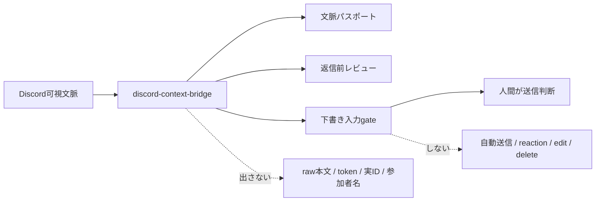
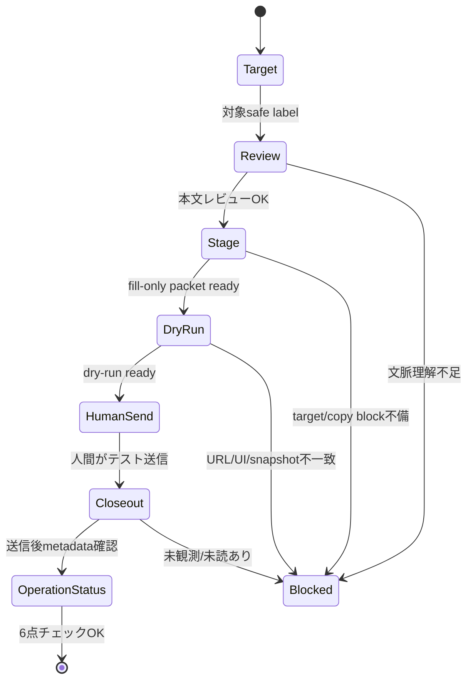

# Discord Context Bridge

Discord Context Bridge は、Discordで見えている会話を local-first に取り込み、
AIが安全に扱える文脈、返信前レビュー、送信直前の確認ログへ変換するための小さな橋です。

このリポは **Discordへ自動送信しません**。
送信ボタン、Enter送信、reaction、edit、delete は人間操作のままにします。

## できること

| やりたいこと | 入口 |
|---|---|
| 可視テキストを取り込む | `import-visible-text` |
| 文脈を整理する | `context-passport` |
| 返信前に本文を確認する | `review-draft` / `guide-reply` |
| Discord URLの保存済みsnapshotを見る | `report-latest` / `coverage-report` |
| 下書き入力直前のgateを作る | `stage-discord-send` |
| Chrome fill-only のdry-runを確認する | `verify-chrome-fill-dry-run` |
| 人間送信後の状態を閉じる | `closeout-discord-send` |
| 既存ログから送信テスト運転表を作る | `send-operation-status` |

## すぐ使う



```bash
PYTHONPATH=src python3 -m discord_context_bridge.cli \
  import-visible-text \
  --input /path/to/visible-discord-text.txt \
  --guild example-community \
  --channel planning
```

```bash
PYTHONPATH=src python3 -m discord_context_bridge.cli \
  context-passport \
  --input /path/to/visible-discord-text.txt \
  --guild example-community \
  --channel planning
```

```bash
PYTHONPATH=src python3 -m discord_context_bridge.cli \
  review-draft \
  --understanding-confirmed \
  --draft "まず前提を確認してから返事します。"
```

## 送信テストの運転表

送信テストは次の6点で見ます。

1. 対象チャンネル/投稿先の明示
2. 送信本文のレビュー
3. dry-run または preview
4. テスト用チャンネルで人間が実送信
5. 送信ログ/失敗時回復の確認
6. 本番送信手順の固定化

既存のgateログを吸い上げるには、`send-operation-status` を使います。



```bash
PYTHONPATH=src python3 -m discord_context_bridge.cli \
  send-operation-status \
  --staging-packet .local/discord-context-bridge/staging-packet.json \
  --dry-run-report .local/discord-context-bridge/fill-dry-run.json \
  --closeout-report .local/discord-context-bridge/send-closeout.json \
  --target-label test-channel \
  --rollback-plan-reviewed \
  --production-runbook-fixed \
  --json
```

詳しい手順は [docs/discord-send-operation-runbook.md](docs/discord-send-operation-runbook.md) を見てください。

## 残TODO

- テスト用チャンネルで人間送信し、`closeout-discord-send` の実ログを残す。
- そのログを `send-operation-status` に渡し、6点チェックが `ok: true` になることを確認する。
- 本番送信前の対象safe label、失敗時回復方針、送信後確認者を決める。
- 送信テストで詰まった blocker を [ISSUE_LIST.md](ISSUE_LIST.md) と [ROADMAP.md](ROADMAP.md) に戻す。

## 安全境界

- 基本言語は日本語です。ユーザーに見える説明、PR本文、運用メモは日本語で意味が分かる形にします。
- raw Discord text、参加者名、token、cookie、webhook、実ID、local absolute path を公開出力に含めません。
- public package は本文処理、metadata-only report、gate、closeout を担当します。
- Discord送信、reaction、edit、delete、repository visibility変更、外部投稿は、人間レビューと明示承認なしに実行しません。
- `send_message()` は意図的に無効です。

## 運用チェック

```bash
python3 scripts/ops_check.py
python3 scripts/repo_goal_status.py --run-smoke --json
python3 scripts/bump_version.py --check
```

PR前には次も確認します。

```bash
python3 scripts/gh_guard.py --json
python3 scripts/pr_readiness_preflight.py --fetch --gh-switch --json
python3 scripts/pr_scope_guard.py --base origin/main --head HEAD --json
python3 scripts/boundary_logic_check.py --json
```

## 詳しい資料

- [docs/discord-send-operation-runbook.md](docs/discord-send-operation-runbook.md): 送信テスト運転表
- [docs/codex-chrome-extension-capability-inventory.md](docs/codex-chrome-extension-capability-inventory.md): Chrome拡張 fill-only 境界
- [docs/architecture-context-closeout.md](docs/architecture-context-closeout.md): closeoutの責務境界
- [docs/codex-discord-ingress.md](docs/codex-discord-ingress.md): Codexから読む時の入口
- [docs/full-reference.md](docs/full-reference.md): 以前の詳細README全文
- [references/initial-thread-ruleset.md](references/initial-thread-ruleset.md): 13工程MVPの判断正本

### Discord Desktop 通知 metadata probe

通知probeは本文取得ではなく、通知が来たかどうかのmetadataだけを見る補助です。
出力schemaは `discord_notification_delta.v1` です。

- Trigger condition: human がDiscord通知を1件発生させる。
- Fallback order: Notification Center、Unified Log、Cache.db。
- blocked reason: `no_notification_observed` / `insufficient_metadata`。
- safety: `text_output="omitted"`、`raw_payload_read=false`、`outbound_actions="disabled"`。

最初の skeleton は、現在見えている Discord 本文を stdout に出すだけ

## MCP

```bash
python3 -m pip install ".[mcp]"
discord-context-bridge-mcp
```

HTTP connectorとして使う場合:

```bash
discord-context-bridge-mcp-http \
  --host 127.0.0.1 \
  --port 8000 \
  --path /mcp \
  --store /tmp/discord-context-events.ndjson \
  --require-safe-store
```

MCPでも送信toolは公開しません。
