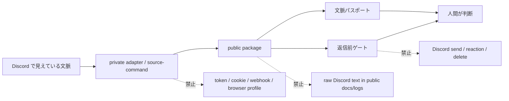

# Discord Context Bridge

Discord Context Bridge は、Discord で見えている会話テキストを、
AI アシスタントが安全に扱える文脈フィードへ変換する local-first な小さな橋です。

目的は Discord アカウントの自動操作ではありません。人間のユーザーが、現在の会話を理解し、
抜けている前提を見つけ、返信する前に自分の返信意図を確認できるようにすることです。

## 全体像



| 領域 | 既定 | 公開してよいもの | 公開しないもの |
|---|---|---|---|
| 入力 | read-only visible context | safe label、件数、状態 | raw 本文、参加者名、実 ID |
| adapter | private / local | stdout 契約、failure_stage | token、cookie、profile |
| public package | 文脈処理 | passport、gate verdict | Discord 認証情報 |
| outbound | disabled | copy/paste 前の確認結果 | send、reaction、delete |

## MVP の正本

MVP の判断正本は [`references/initial-thread-ruleset.md`](references/initial-thread-ruleset.md)
の13工程です。レビューしやすい補助表示として
[`references/initial-thread-ruleset.html`](references/initial-thread-ruleset.html)
を置きます。

13工程からはみ出すものは MVP 外です。CLI、MCP、plugin、ChatGPT connector、
実機 capture、Discord 自動操作は、既存実装があっても MVP の成立条件にはしません。
これらは必要な時だけ使う任意 adapter / developer verification として扱います。

## 基本言語

この package の基本言語は日本語です。

- README、SECURITY、公開 checklist などの利用者向け文書は日本語を既定にします。
- CLI / API のユーザー向けメッセージは日本語を既定にします。
- コード識別子、JSON key、コマンド名、package 名は英語のまま維持します。
- 英語は protocol 互換、検索性、OSS 利用者への補助説明が必要な場所に限定します。

## できること

- 見えている、またはコピーした Discord テキストを local append-only event store に取り込みます。
- 直近メッセージから短い briefing を作ります。
- スレッドの目的、流れ、前提、ルール注意、温度感を文脈パスポートとして確認します。
- local command で取得した可視テキストを監視し、文脈パスポートを自動更新します。
- 返信を書く前に、足りない前提や文脈ズレを検出します。
- ユーザーの返信意図を直近会話と照合します。
- local command で取得した可視テキストを監視し、会話ガイドを自動更新します。
- Discord への送信は既定で禁止します。

## しないこと

- Discord にログインしません。
- Discord user token、bot token、cookie、webhook URL を読みません。
- 単体で private data を scraping しません。
- Discord にメッセージを送信しません。
- 実 guild ID、channel ID、handle、private message 本文を含めません。

## 使い方

開発と PR の境界は [PROCESS_BOUNDARY.md](PROCESS_BOUNDARY.md) を見てください。

実装後の最短チェックを並列で実行します。

```bash
python3 scripts/ops_check.py
```

push / PR 前に GitHub account と remote owner の一致も確認する場合は、次を使います。

```bash
python3 scripts/ops_check.py --gh --gh-switch
```

sandbox などで token 利用確認だけが通らない場合は、active account の一致だけを確認できます。

```bash
python3 scripts/ops_check.py --gh --gh-account-only
```

HTTP MCP 起動スモークまで含める場合は、MCP 依存を入れた Python を指定して実行します。

```bash
DCB_MCP_PYTHON=/path/to/mcp-enabled/python \
  python3 scripts/ops_check.py --http
```

test を実行します。

```bash
python3 -m pytest tests -q
```

Discord 本文取得 adapter を fixture で確認します。

```bash
python3 scripts/read_visible_discord_text.py \
  --input tests/fixtures/discord_rich_copy.txt
```

ローカル運用スモークを一気に実行します。

```bash
DCB_MCP_PYTHON=/path/to/mcp-enabled/python \
  python3 scripts/local_smoke.py --reset --port 8018
```

### 最小MVP: 文脈パスポート

この節のコマンドは developer verification 用の例です。MVP の正本は
`references/initial-thread-ruleset.md` の13工程であり、CLI を日常利用導線や
MVP 成立条件にはしません。

目標は copy / paste 運用ではなく、自動で Discord の見えている文脈を読み、会話に入る前の理解差を埋めることです。
public package では Discord login、cookie、token、webhook を扱わず、画面観測や OCR などの private adapter は
`--source-command` に差し込む形にします。

最初に確認するのは返信文ではなく、スレッドの文脈です。

```bash
PYTHONPATH=src python3 -m discord_context_bridge.cli \
  context-passport \
  --input tests/fixtures/thread_context_passport.txt
```

local observer command から会話本文を自動取得して、文脈パスポートを作れます。
`--source-command` は `PYTHONPATH=src python3 ...` のような先頭 env 指定も受け付けます。

```bash
PYTHONPATH=src python3 -m discord_context_bridge.cli \
  context-passport \
  --source-command "python3 scripts/read_visible_discord_text.py"
```

サーバールール、チャンネル目的、スレッド固定文などを別ファイルで持っている場合は、
会話本文と一緒に明示文脈として渡せます。これにより、本文の直近範囲にルールが見えていない時でも、
発話前チェックで場の目的や注意点を落としにくくします。

```bash
PYTHONPATH=src python3 -m discord_context_bridge.cli \
  context-passport \
  --source-command "python3 scripts/read_visible_discord_text.py" \
  --server-context /path/to/server-rules.txt \
  --channel-context /path/to/channel-purpose.txt \
  --thread-context /path/to/thread-context.txt
```

何度も使う文脈は、ローカル文脈庫へ保存できます。実データを含む可能性があるため、
文脈庫は `.local/discord-context-bridge/context-library.json` に置き、commit しません。

```bash
PYTHONPATH=src python3 -m discord_context_bridge.cli \
  context-upsert \
  --kind server \
  --key nexus \
  --input /path/to/server-rules.txt

PYTHONPATH=src python3 -m discord_context_bridge.cli \
  audit-context-store

PYTHONPATH=src python3 -m discord_context_bridge.cli \
  context-passport \
  --source-command "python3 scripts/read_visible_discord_text.py" \
  --server-context-key nexus
```

safe label だけで文脈庫を補助参照したい場合は、文脈に安全な別名を付けて保存し、
`context-passport` / `watch-passport` で `--auto-context-bindings` を使えます。
明示した `--server-context-key` などがある場合は、そちらを優先します。

```bash
PYTHONPATH=src python3 -m discord_context_bridge.cli \
  context-upsert \
  --kind channel \
  --key planning \
  --label example-community/safe-planning \
  --input /path/to/channel-purpose.txt

PYTHONPATH=src python3 -m discord_context_bridge.cli \
  context-passport \
  --source-command "python3 scripts/read_visible_discord_text.py" \
  --guild example-community \
  --channel safe-planning \
  --auto-context-bindings
```

local observer command を監視し、Discord の見えている会話が変わった時だけ文脈パスポートを更新できます。
まずは返信を作る前に、スレッド目的、参加者の温度感、暗黙前提、ルール注意を追いかける入口として使います。

```bash
PYTHONPATH=src python3 -m discord_context_bridge.cli \
  watch-passport \
  --source-command "PYTHONPATH=src python3 scripts/read_visible_discord_text.py" \
  --server-context-key nexus \
  --interval 1
```

返信前は、保存済みの直近文脈に対して下書きを gate できます。このコマンドも Discord へ送信しません。

```bash
PYTHONPATH=src python3 -m discord_context_bridge.cli \
  --store .local/discord-context-bridge/events.ndjson \
  review-draft \
  --draft "まず前提を確認してから返事します。"
```

Markdown artifact として保存してから人間が直接編集する場合は、`--artifact-path`
を指定します。保存先 path は CLI 出力に表示せず、artifact 本文にも Discord の raw
本文や参加者名を入れません。

```bash
PYTHONPATH=src python3 -m discord_context_bridge.cli \
  --store .local/discord-context-bridge/events.ndjson \
  review-draft \
  --draft "まず前提を確認してから返事します。" \
  --artifact-path .local/discord-context-bridge/review.md
```

artifact には `final candidate`、`human gate`、`copy block`、`safety boundary`
が入ります。`copy block` は `ready` ならそのままコピー候補、`split` なら2分割
まで、`blocked` なら3分割以上になるため短く編集してから再レビューします。

文脈パスポートは次を返します。

- スレッドの目的
- 直近の流れ
- 暗黙の前提候補
- ルール注意
- 人や場の温度感
- 入るなら自然な角度
- 明示文脈を使ったか
- 参照した文脈ソース

### 次MVP: Discord 本文取得 adapter

次の MVP は、public package 本体ではなく private adapter を足して、Discord を開いたまま本文取得だけを自動化する段階です。
public package は引き続き token、cookie、webhook、browser profile を受け取らず、adapter の stdout だけを読みます。

ロードマップは、車輪の再発明を避けるために OS / browser の既存機能を優先して薄く切ります。

1. **Accessibility 経路**
   - macOS Accessibility で window 候補、番号選択、前面化なし取得、短い timeout を確認します。
   - 成功すれば最速です。失敗しても、window が見えない、空読み、timeout を人間語で切り分けます。
2. **ScreenCapture / OCR 経路**
   - Accessibility で window が見えない場合は、Apple ScreenCaptureKit / Vision OCR の private adapter へ切ります。
   - public package は画像 capture や permission prompt を直接持たず、stdout 契約で本文だけを受けます。
3. **Browser 経路**
   - Discord Web を読む場合は Playwright などの既存 browser automation を private adapter に隔離します。
   - browser profile、cookie、storage state は credential として扱い、public repository へ入れません。
4. **運用統合**
   - 取得した本文を `live_ops_smoke.py`、`watch-passport`、`watch-guide` に差し込みます。
   - 成功条件は `parsed > 0`、本文非表示、送信無効、安全監査 pass です。

調査表:

| 経路 | 採用判断 | 理由 |
|---|---|---|
| macOS Accessibility / AXUIElement | 第一候補 | token/cookie不要。見えている UI tree を読める可能性がある。Discord/Electron が本文を安定露出しない場合は空読みや timeout になる。 |
| ScreenCapture / OCR | fallback 採用 | token/cookie不要。見えている pixel だけを local 処理できる。Screen Recording 権限、OCR 誤読、重なりに注意する。 |
| Browser automation | private 実験のみ | Playwright など既存機能は強いが、browser profile、cookie、storage state を credential として扱う必要がある。 |
| Discord Bot / official API | 別用途 | bot が参加し権限を持つ範囲では正攻法。ただし「ユーザーに見えている任意の本文」を読む代替ではない。 |
| user token / selfbot | 不採用 | 通常ユーザーアカウント自動化の禁止境界に触れるため扱わない。 |

public package 側は、取得そのものを抱え込まず、private adapter の stdout contract と安全監査に集中します。

最初の skeleton は、現在見えている Discord 本文を stdout に出すだけの小さな command です。

```text
scripts/read_visible_discord_text.py
```

実装イメージ:

```python
def main() -> int:
    window = find_discord_window()
    visible_thread = read_active_thread(window)
    messages = extract_visible_messages(visible_thread)
    print(format_as_visible_text(messages))
    return 0
```

この adapter が満たす契約は 4 つです。

- stdout には、現在見えている会話本文だけを出す。
- token、cookie、webhook URL、profile path、実 user ID を出さない。
- Discord へ投稿、削除、reaction、既読操作をしない。
- 失敗時は stderr に理由を書き、non-zero exit で止まる。

adapter ができたら、既存の `watch-passport` と `watch-guide` にそのまま差し込みます。

```bash
PYTHONPATH=src python3 -m discord_context_bridge.cli \
  watch-passport \
  --source-command "python3 scripts/read_visible_discord_text.py --macos-accessibility --window-name-contains nexus-ai" \
  --server-context-key nexus \
  --interval 1
```

実運用に入る前に、adapter 経由の smoke を先に通します。

```bash
PYTHONPATH=src python3 scripts/local_smoke.py \
  --source-command "python3 scripts/read_visible_discord_text.py --input tests/fixtures/discord_rich_copy.txt" \
  --reset \
  --skip-http
```

実 Discord 画面で試す時は、本文を terminal に出さない smoke を使います。
これは adapter の stdout を取り込みますが、表示するのは safe label、件数、last_seen、delta count、
gate verdict、outbound disabled だけです。

実機準備をまとめて見る場合は probe pack を使います。本文は表示せず、依存コマンド、OCR fixture、
live smoke、必要に応じて Accessibility probe の成否だけを出します。

```bash
python3 scripts/probe_visible_source.py \
  --ocr-command "tesseract {image} stdout -l jpn+eng" \
  --source-command "python3 scripts/read_screenshot_ocr_text.py --image tests/fixtures/discord_rich_copy.txt --ocr-command 'cat {image}'" \
  --ax-probe \
  --json
```

`text_output` は常に `omitted` です。この probe pack から Discord へ送信しません。

private adapter を環境変数で渡す場合は、まず軽い probe だけを単独で通します。これは本文を返さず、
解析件数と失敗 stage だけを返します。

```bash
DISCORD_CONTEXT_BRIDGE_PRIVATE_COMMAND="python3 scripts/read_screenshot_ocr_text.py --image tests/fixtures/discord_rich_copy.txt --ocr-command 'cat {image}'" \
PYTHONPATH=src:scripts \
python3 scripts/private_adapter_probe.py
```

private adapter の実運用ステータスを 1 コマンドで見る場合は、preflight、live smoke、ops check を順番に回します。
出力は本文、参加者名、store path を出さず、件数と安全境界だけを返します。

```bash
python3 scripts/live_mvp_status.py \
  --source-command "python3 scripts/read_visible_discord_text.py --input tests/fixtures/discord_rich_copy.txt" \
  --skip-preflight
```

Discord の会話領域が分かっている場合は、環境変数で private command を組まずに region profile を直接渡せます。
この経路も region 必須で、full-screen capture は使いません。

```bash
python3 scripts/live_mvp_status.py \
  --capture-profile macos-screencapture-region \
  --capture-region "0,0,1400,1000" \
  --ocr-language jpn+eng \
  --capture-timeout 120 \
  --source-timeout 130 \
  --timeout 150 \
  --ops-timeout 90
```

adapter probe と live smoke だけを切り分けたい場合は E2E check を使います。

```bash
python3 scripts/e2e_private_adapter_check.py \
  --source-command "python3 scripts/read_visible_discord_text.py --input tests/fixtures/discord_rich_copy.txt"
```

実機前の依存関係と Discord window 状態だけを見る場合は preflight を使います。
これは本文を読みません。

```bash
python3 scripts/ops_preflight.py --app-name Discord
```

preflight でも同じ region profile を渡すと、private adapter 設定済みとして依存関係と window 状態を確認できます。

```bash
python3 scripts/ops_preflight.py \
  --app-name Discord \
  --capture-profile macos-screencapture-region \
  --capture-region "0,0,1400,1000"
```

`@discord` bot route が使える環境では、token 値や snowflake 値を出さずに設定状態だけを確認できます。
token 保存、pairing approval、allowlist 変更はこの repository の自動処理には含めません。

```bash
python3 scripts/discord_bot_route_preflight.py
```

`@discord`、`discord:configure`、`discord:access`、Computer Use fallback、OCR fallback をまとめて見る場合は、
route status を使います。これは本文、参加者名、token、snowflake 値を出さず、どの入口を次に使うべきかだけを返します。
経路の考え方は [`docs/routes.md`](docs/routes.md) に分けています。

```bash
python3 scripts/discord_plugin_route_status.py --json
```

この status command では、`discord:configure` と `discord:access` は control plane として扱います。
設定や許可の変更は、ユーザーが明示した plugin command にだけ委ねます。本文を文脈カード / 返信前 gate へ流す本線は
`bot_private_ingest` です。Computer Use は画面確認 fallback、OCR は region 必須 fallback として残します。

bot channel server や private adapter から受け取った本文を、本文なしで文脈カード / 返信前 gate へ流す場合は
private ingest smoke を使います。標準入力または一時ファイルから受け取りますが、本文、参加者名、token、
snowflake は JSON に出しません。

```bash
cat /private/path/from-discord-channel.txt | \
  python3 scripts/discord_bot_private_ingest.py \
    --guild safe-guild \
    --channel safe-channel \
    --draft "前提を確認します。" \
    --json
```

本線 route の準備状態と private ingest をまとめて確認する場合は、main route smoke を使います。

```bash
cat /private/path/from-discord-channel.txt | \
  python3 scripts/discord_main_route_smoke.py --json
```

bot channel server / private adapter から渡せる text event が届いているかだけを見る場合は、
channel event probe を使います。これは本文や file name を出しません。

```bash
python3 scripts/discord_channel_event_probe.py --json
```

private adapter の stdout を channel inbox の text event に渡す場合は live text source を使います。
これは本文を private inbox に保存しますが、stdout / JSON には本文、参加者名、file name、token、
snowflake を出しません。

```bash
python3 scripts/discord_live_text_source.py \
  --source-command "python3 scripts/read_visible_discord_text.py --input tests/fixtures/discord_rich_copy.txt" \
  --json
```

E2E をまとめて見る場合は、fixture / private text と実イベント probe を同時に確認します。

```bash
python3 scripts/e2e_discord_route_check.py \
  --input tests/fixtures/discord_rich_copy.txt \
  --json
```

通常利用の main route を source command から一気に確認する場合は、E2E check に source command を渡します。
この経路では `source-command -> inbox text event -> main route smoke` までを通し、
`--require-channel-event` で fixture だけの成功を禁止できます。

```bash
python3 scripts/e2e_discord_route_check.py \
  --source-command "python3 scripts/read_visible_discord_text.py --input tests/fixtures/discord_rich_copy.txt" \
  --require-channel-event \
  --json
```

Discord の会話領域が分かっている場合は、任意の capture command を書かずに region profile で試せます。

```bash
python3 scripts/probe_visible_source.py \
  --capture-profile macos-screencapture-region \
  --capture-region "0,0,1400,1000" \
  --ocr-language eng \
  --json
```

この経路も `live_ops_smoke.py` 経由で確認するため、本文は表示しません。範囲は `x,y,w,h` 形式で、
`w` と `h` は 1 以上です。日本語 OCR を使う場合は、tesseract の `jpn` traineddata を導入してから
`--ocr-language jpn+eng` を指定してください。

まず window 候補だけを短く確認します。この出力は本文ではなく、既定では raw window 名も出しません。

```bash
python3 scripts/read_visible_discord_text.py \
  --list-macos-windows \
  --timeout 5
```

window 名を見て選びたい時だけ、local terminal で `--show-window-names` を明示します。
通常は候補番号を `--window-index` に渡すと、raw window 名を見ずに試せます。

```bash
PYTHONPATH=src python3 scripts/live_ops_smoke.py \
  --source-command "python3 scripts/read_visible_discord_text.py --macos-accessibility --window-index 1 --timeout 5" \
  --source-timeout 8 \
  --channel visible-thread \
  --reset
```

Discord を前面化したくない場合は `--no-focus` を付けます。これは window 候補を確認した上で、
対象 window の full scan だけを試します。

```bash
PYTHONPATH=src python3 scripts/live_ops_smoke.py \
  --source-command "python3 scripts/read_visible_discord_text.py --macos-accessibility-auto --no-focus --window-index 1 --timeout 3" \
  --source-timeout 12 \
  --channel visible-thread \
  --reset
```

どの候補が読めるかだけを確認したい場合は、本文を出さない probe を使います。

```bash
python3 scripts/read_visible_discord_text.py \
  --probe-macos-accessibility \
  --no-focus \
  --timeout 3
```

JSON 出力では、粗い分類として `failure_stage`、次に見る場所として `source_stage` を返します。
たとえば `failure_stage=timeout` の場合でも、`source_stage=window_list_timeout` なら window 候補取得、
`source_stage=full_scan_timeout` なら window 内の Accessibility full scan を疑います。
`failure_stage=ocr_empty` の場合は、capture 自体は動いていても、指定 region に OCR できる本文が映っていないか、
対象範囲が小さすぎる可能性を疑います。
raw window 名や本文はこの JSON には出しません。

1回の取得で空読みやtimeoutになる場合は、自動fallback付きで試します。これは focused element を短く試し、
だめなら同じ window の full scan、必要なら前面 window へ戻す順で確認します。

```bash
PYTHONPATH=src python3 scripts/live_ops_smoke.py \
  --source-command "python3 scripts/read_visible_discord_text.py --macos-accessibility-auto --window-index 1 --timeout 3" \
  --source-timeout 12 \
  --channel visible-thread \
  --reset
```

`live_ops_smoke.py` は、解析件数が 0 件の時は `source_not_ready` として失敗します。
本文を表示せずに、取得経路が運用可能かだけを確認できます。

macOS Accessibility や browser automation が環境依存で不安定な場合は、private 側の command を `--source-command` に渡します。
その command も stdout には可視本文だけを出し、credential や profile path を出さない契約にします。

ScreenCapture / OCR 経路を運用確認する場合は、本文を terminal に出さない `probe_visible_source.py` か
`live_ops_smoke.py` を既定にします。private adapter 開発者が OCR runner を直接試す場合だけ、
次の command を local terminal で実行します。直接実行すると OCR で読めた本文が stdout に出ます。

```bash
python3 scripts/read_screenshot_ocr_text.py \
  --capture-profile macos-screencapture-region \
  --capture-region "0,0,1200,900" \
  --ocr-command "tesseract {image} stdout -l eng"
```

任意の private capture command を使う場合だけ、次の形式にします。`screencapture` を使う場合は
full screen capture を避けるため、`-R x,y,w,h` が必要です。

```bash
python3 scripts/read_screenshot_ocr_text.py \
  --screenshot-command "screencapture -x -R0,0,1200,900 {image}" \
  --ocr-command "tesseract {image} stdout -l jpn+eng"
```

既に画像がある場合は、OCR command だけを検証できます。実画像は commit しません。

```bash
python3 scripts/read_screenshot_ocr_text.py \
  --image /path/to/local-capture.png \
  --ocr-command "tesseract {image} stdout -l jpn+eng"
```

### 返信前ガイド

Discord でコピーした会話本文と、自分の返信 draft から、返信前の確認ガイドも出せます。

```bash
PYTHONPATH=src python3 -m discord_context_bridge.cli \
  guide-reply \
  --input tests/fixtures/discord_rich_copy.txt \
  --draft "公開時期の前提を確認してから返信します。"
```

local observer command から会話本文を自動取得して、単発で返信ガイドを作れます。

```bash
PYTHONPATH=src python3 -m discord_context_bridge.cli \
  guide-reply \
  --source-command "python3 scripts/read_visible_discord_text.py" \
  --draft "公開時期の前提を確認してから返信します。"
```

local observer command を監視し、Discord の見えている会話が変わった時だけ返信ガイドを更新できます。

```bash
PYTHONPATH=src python3 -m discord_context_bridge.cli \
  watch-guide \
  --source-command "python3 scripts/read_visible_discord_text.py" \
  --draft "公開時期の前提を確認してから返信します。" \
  --interval 1
```

`scripts/read_visible_discord_text.py` は public-safe な adapter runner です。実運用では、macOS Accessibility、
ブラウザ automation、OCR、または既存の desktop observer が「現在見えている Discord 本文」を stdout に出します。
credential や browser profile を直接扱う処理は private 側に置き、public package には入れません。

clipboard から直接試す場合は次を使います。

```bash
PYTHONPATH=src python3 -m discord_context_bridge.cli \
  guide-reply \
  --from-clipboard \
  --draft "公開時期の前提を確認してから返信します。"
```

Discord で会話を選択してコピーしたあと、clipboard から取り込みます。

```bash
PYTHONPATH=src python3 -m discord_context_bridge.cli \
  --store /tmp/discord-context-events.ndjson \
  import-clipboard \
  --guild example-community \
  --channel general
```

clipboard 入力でローカル運用スモークを一気に実行します。

```bash
DCB_MCP_PYTHON=/path/to/mcp-enabled/python \
  python3 scripts/local_smoke.py --from-clipboard --reset --port 8018
```

clipboard の変化を監視し、コピーし直した会話だけ取り込みます。

```bash
PYTHONPATH=src python3 -m discord_context_bridge.cli \
  --store /tmp/discord-context-events.ndjson \
  watch-clipboard \
  --guild example-community \
  --channel general \
  --interval 1
```

visible text fixture を取り込みます。

```bash
PYTHONPATH=src python3 -m discord_context_bridge.cli \
  --store /tmp/discord-context-events.ndjson \
  import-visible-text \
  --input tests/fixtures/visible_text.txt \
  --guild example-community \
  --channel general
```

保存前に parsing 結果だけ確認します。

```bash
PYTHONPATH=src python3 -m discord_context_bridge.cli \
  --store /tmp/discord-context-events.ndjson \
  import-visible-text \
  --input tests/fixtures/discord_rich_copy.txt \
  --dry-run
```

briefing を表示します。

```bash
PYTHONPATH=src python3 -m discord_context_bridge.cli \
  --store /tmp/discord-context-events.ndjson \
  fast-briefing
```

ChatGPT connector や tunnel に出す前に、event store に private data らしきものがないか確認します。

```bash
PYTHONPATH=src python3 -m discord_context_bridge.cli \
  --store /tmp/discord-context-events.ndjson \
  audit-store
```

返信意図を確認します。

```bash
PYTHONPATH=src python3 -m discord_context_bridge.cli \
  --store /tmp/discord-context-events.ndjson \
  review-intent \
  --draft "これは公開時期の話で、足りない前提を確認してから返信します。"
```

## MCP server として使う

MCP server は任意 adapter です。Codex / Claude から常用する場合は CLI より
MCP server を入口にできますが、MVP の必須条件ではありません。

```bash
python3 -m pip install ".[mcp]"
discord-context-bridge-mcp
```

MCP tool は 9 つです。

- `import_visible_discord_text`: Discord の可視テキストを local event store に取り込みます。
- `get_fast_briefing`: 直近文脈の短い briefing を返します。
- `audit_event_store_before_tunnel`: tunnel 公開前に local event store の安全性を確認します。
- `review_reply_before_send`: 送信前の返信 draft を直近文脈と照合します。
- `guide_reply_from_visible_text`: Discord の可視テキストと返信 draft から会話ガイドを返します。
- `get_context_passport_from_visible_text`: Discord の可視テキストからスレッド文脈パスポートを返します。
- `upsert_context_library_entry`: サーバー/チャンネル/スレッド文脈をローカル文脈庫へ保存します。
- `list_context_library_entries`: ローカル文脈庫の一覧を返します。本文は返さず summary だけ返します。
- `audit_context_library_before_tunnel`: tunnel 公開前にローカル文脈庫の安全性を確認します。

送信 tool はありません。返信は人間が Discord 側で送信する前提です。

`get_context_passport_from_visible_text` は `server_context`、`channel_context`、`thread_context` を受け取れます。
各値には、サーバールール、チャンネル目的、スレッド固定文などのローカルで確認済みテキストを渡します。
また `server_context_key`、`channel_context_key`、`thread_context_key` でローカル文脈庫の保存済み文脈を参照できます。

`import_visible_discord_text` は `dry_run=true` で保存前 preview として使えます。

### ChatGPT connector 用に HTTP で起動する

ChatGPT Apps / Connector から試す場合は、streamable HTTP MCP server として `/mcp` を出します。
これは任意 route であり、13工程MVPや返信前レビューの必須条件ではありません。

```bash
python3 -m pip install ".[mcp]"
discord-context-bridge-mcp-http \
  --host 127.0.0.1 \
  --port 8000 \
  --path /mcp \
  --store /tmp/discord-context-events.ndjson \
  --require-safe-store
```

local で起動したあと、Secure MCP Tunnel、ngrok、Cloudflare Tunnel などで HTTPS URL を作り、
ChatGPT の connector URL に `https://.../mcp` を登録します。

注意:

- tunnel で外部公開する前に、event store に実 private data が混ざっていないか確認してください。
- `audit-store` または `audit_event_store_before_tunnel` が `safe_for_tunnel=true` になることを確認してください。
- `--require-safe-store` を付けると、監査に失敗した event store では HTTP MCP server が起動しません。
- この package は送信 tool を公開しません。
- Discord token、cookie、webhook URL は不要です。

## データ契約

event store は newline-delimited JSON です。local-only で扱い、実会話データを含む場合は
commit しません。

各 event は意図的に小さく保ちます。

- `observed_at`
- `source`
- `guild_label`
- `channel_label`
- `author_label`
- `text_snippet`
- `actions_allowed`
- `private_surface`

label は human-safe な alias にしてください。その境界を明示的に選んだ場合を除き、
実 private identifier は保存しません。

context store の `labels` も同じく human-safe な alias だけを入れます。
`example-community/safe-planning` のような guild/channel label は自動紐付けのための公開安全な名前であり、
Discord の実 ID ではありません。

## 公開安全境界

この repository は、公開可能な nucleus package として設計しています。
含める fixture は合成データだけで、credential は含めません。browser、desktop app、
automation profile から読み取る adapter は、個別の security review が終わるまで
この package の外に置きます。
