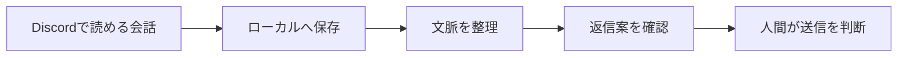

# Discord Context Bridge

Discordで読める会話をローカルに保存し、AIが安全に理解・確認できる文脈へ変換するツールです。

主な用途は次の3つです。

- 会話の目的、前提、決定事項を整理する
- 返信案を送る前にレビューする
- 保存済み会話の範囲と鮮度を確認する

> [!IMPORTANT]
> Discord Context Bridge（DCB）のpublic coreは、Discordへ投稿しません。
> token、cookie、webhook、実ID、参加者名、会話本文を公開出力へ含めません。

## 仕組み


```mermaid
flowchart LR
  discord["Discordで読める会話"] --> capture["ローカルへ保存"]
  capture --> context["文脈を整理"]
  context --> review["返信案を確認"]
  review --> human["人間が送信を判断"]
```

DCBは会話を追記型の台帳へ保存します。文脈パスポート、最新レポート、Markdownは、その台帳から作る閲覧用データです。

## クイックスタート

Python 3.11以上が必要です。

### 1. インストール

```bash
python -m pip install .
```

MCPも使う場合:

```bash
python -m pip install ".[mcp]"
```

### 2. Discordの可視テキストを用意する

会話本文をprivateなローカルファイルへ保存します。DCBはChrome profileからtokenやcookieを抽出しません。

### 3. 取り込んで文脈を確認する

`bridge-intake`は、本文の保存、取得範囲の確認、文脈パスポートの生成をまとめて行います。

```bash
discord-context-bridge bridge-intake \
  --url 'https://discord.com/channels/<guild>/<channel>/<message>' \
  --input /private/path/visible-discord-text.txt \
  --understanding-confirmed \
  --json
```

Windows PowerShell:

```powershell
discord-context-bridge bridge-intake `
  --url "https://discord.com/channels/<guild>/<channel>/<message>" `
  --input "C:\private\visible-discord-text.txt" `
  --understanding-confirmed `
  --json
```

コマンドの標準出力はmetadataのみです。会話本文はprivateな保存領域から外へ出しません。

## やりたいことから選ぶ

| やりたいこと | コマンド |
|---|---|
| 取り込みから文脈整理まで一括実行する | `bridge-intake` |
| 可視テキストだけ取り込む | `import-visible-text` |
| 会話の目的・前提・流れを確認する | `context-passport` |
| 返信に必要な文脈を判定する | `reply-context-plan` |
| 返信案をレビューする | `review-draft` / `guide-reply` |
| 保存範囲と鮮度を確認する | `coverage-report` / `report-latest` |
| ローカルcacheを確認する | `cache-inventory` |

全コマンドは[詳細リファレンス](docs/full-reference.md)を参照してください。

## 利用方法

| 入口 | 用途 |
|---|---|
| `discord-context-bridge` | CLIから取り込み・確認する |
| runtime skill/plugin | Codexなどのエージェントから呼び出す |
| `discord-context-bridge-mcp` | MCPクライアントへstdio接続する |
| `discord-context-bridge-mcp-http` | 認証付きHTTPで接続する |

すべて同じread-only／metadata-only境界に従います。MCPにもDiscord送信toolはありません。

## 保存モデル

| データ | 役割 |
|---|---|
| 追記型ledger | 取得した観測履歴の正本 |
| projection | ledgerから再構築する最新状態 |
| digest | 文脈パスポートや返信ガイドなどの閲覧物 |

同じ本文を再取得しても観測記録を追記し、`content_hash`や`changed`で差分を表します。保存先とcross-device運用は[運用契約](docs/operating-contract.md)を参照してください。

## 安全境界

- Discordへの送信、reaction、edit、deleteを実行しない
- raw本文、認証情報、実ID、参加者名、ローカル絶対パスを公開しない
- `raw Discord text`と`local path`はprivate領域に閉じ、`outbound_actions`は既定で無効にする
- `send_message()`は無効化し、`pr_scope_guard.py`でpublic／private差分を検査する
- Chrome profileからuser token、cookie、localStorageを抽出しない
- OCR、screenshot、headless browserを本文取得の既定経路にしない
- 公開、外部共有、repository visibility変更には人間レビューと明示承認を求める

詳しくは[運用契約](docs/operating-contract.md)と[取得経路](docs/routes.md)を参照してください。

### Discord Desktop 通知 metadata probe

通知probeは本文を読まず、通知の有無だけを確認する補助経路です。

- schema: `discord_notification_delta.v1`
- Trigger condition: 人間がDiscord通知を1件発生させる
- Fallback order: Notification Center → Unified Log → Cache.db
- blocked reason: `no_notification_observed` / `insufficient_metadata`
- safety: `text_output="omitted"`、`raw_payload_read=false`、`outbound_actions="disabled"`

## MCP HTTP

HTTP接続はBearer認証が既定で必須です。

```bash
export DISCORD_CONTEXT_BRIDGE_MCP_HTTP_TOKEN='<bearer-token>'
discord-context-bridge-mcp-http \
  --host 127.0.0.1 \
  --port 8000 \
  --path /mcp \
  --store /private/path/discord-context-events.ndjson
```

localhostで明示的に使う場合だけ、`--allow-unauthenticated`で認証を無効化できます。

## 開発と運用

基本言語は日本語です。利用者向け文書とPR本文も日本語を既定にします。

```bash
python scripts/ops_check.py --profile fast
python scripts/ops_check.py --profile full
python scripts/verify_ssot_projection.py --json
```

runtime skillは`capability/manifest.yaml`と`docs/operating-contract.md`から生成します。生成済み`SKILL.md`は直接編集しません。

| 資料 | 内容 |
|---|---|
| [詳細リファレンス](docs/full-reference.md) | CLIと運用手順 |
| [運用契約](docs/operating-contract.md) | runtime共通の安全境界 |
| [取得経路](docs/routes.md) | 取得経路とfallback |
| [Codex ingress](docs/codex-discord-ingress.md) | Codexから読む入口 |
| [将来アーキテクチャ案](docs/future-proof-architecture.md) | 採用前の耐久性設計案 |
| [ロードマップ](ROADMAP.md) | 今後の計画 |
| [Issue一覧](ISSUE_LIST.md) | active TODO |

ライセンスは[MIT License](LICENSE)です。
