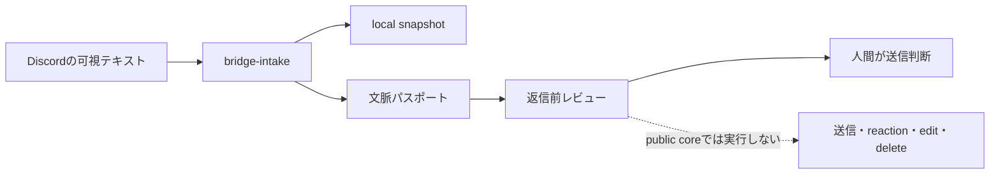

# Discord Context Bridge

Discordで見えている会話を、AIが安全に扱える文脈へ変換する
local-firstのブリッジです。

- 会話の目的・前提・流れを整理する
- 返信案を送信前にレビューする
- 保存済みsnapshotの範囲と鮮度を確認する
- CLI、runtime skill/plugin、MCPから同じ安全境界で使う

> [!IMPORTANT]
> public coreはDiscordへ直接送信しません。
> token、cookie、webhook、実ID、参加者名、raw本文を公開出力に含めません。

## 30秒で分かる流れ


```mermaid
flowchart LR
  visible["Discordの可視テキスト"] --> intake["bridge-intake"]
  intake --> ledger["local snapshot"]
  intake --> context["文脈パスポート"]
  context --> review["返信前レビュー"]
  review --> human["人間が送信判断"]

  review -. "public coreでは実行しない" .-> send["送信・reaction・edit・delete"]
```

## どの入口を使うか

| 使い方 | 向いている場面 | 入口 |
|---|---|---|
| CLI | ローカルで取り込み・確認する | `discord-context-bridge` |
| runtime skill/plugin | Codexなどのエージェントから安全に呼ぶ | `discord-context-bridge` skill |
| MCP stdio | MCPクライアントへローカル接続する | `discord-context-bridge-mcp` |
| MCP HTTP | 認証付きHTTP connectorとして使う | `discord-context-bridge-mcp-http` |

すべて同じread-only／metadata-only境界に従います。MCPにも送信toolはありません。

## インストール

Python 3.11以上が必要です。

```bash
python -m pip install .
```

MCPも使う場合:

```bash
python -m pip install ".[mcp]"
```

開発checkoutから直接試す場合は、以下の例のように`PYTHONPATH=src`を付けます。

## 最短の使い方

message found後の推奨入口は`bridge-intake`です。snapshot保存、coverage確認、
文脈パスポート、任意の返信ガイドを1コマンドで進めます。

```bash
PYTHONPATH=src python -m discord_context_bridge.cli \
  bridge-intake \
  --url 'https://discord.com/channels/<guild>/<channel>/<message>' \
  --input /path/to/visible-discord-text.txt \
  --draft "まず前提を確認してから返事します。" \
  --understanding-confirmed \
  --json
```

Windows PowerShell:

```powershell
$env:PYTHONPATH = "src"
python -m discord_context_bridge.cli `
  bridge-intake `
  --url "https://discord.com/channels/<guild>/<channel>/<message>" `
  --input "C:\private\visible-discord-text.txt" `
  --understanding-confirmed `
  --json
```

`stdout`はmetadata-onlyです。raw本文は指定したlocal/private領域に閉じます。

## 主なコマンド

| やりたいこと | コマンド |
|---|---|
| 可視テキストをまとめて取り込む | `bridge-intake` |
| 可視テキストだけを取り込む | `import-visible-text` |
| 会話の目的・前提・流れを見る | `context-passport` |
| 返信に必要な最低文脈を判定する | `reply-context-plan` |
| 下書きをレビューする | `review-draft` / `guide-reply` |
| 保存範囲と鮮度を見る | `coverage-report` / `report-latest` |
| URL完全一致のlocal cacheを見る | `cache-inventory` |
| 保存先をdry-runで確認する | `configure-local-cache` |
| 送信直前のgateを作る | `stage-discord-send` |
| 運用状況をまとめる | `send-operation-status` |

全コマンドと判断状態は[詳細リファレンス](docs/full-reference.md)を参照してください。

## MCP

stdio:

```bash
discord-context-bridge-mcp
```

認証付きHTTP:

```bash
export DISCORD_CONTEXT_BRIDGE_MCP_HTTP_TOKEN='<bearer-token>'
discord-context-bridge-mcp-http \
  --host 127.0.0.1 \
  --port 8000 \
  --path /mcp \
  --store /private/path/discord-context-events.ndjson
```

- Bearer認証は既定で必須です。
- event storeの起動前監査も既定で有効です。
- localhost限定で明示的に使う場合だけ`--allow-unauthenticated`でopt-outできます。

## 保存モデル

履歴の正本はappend-only ledgerです。Markdownやlatest reportは派生viewです。

| 層 | 役割 |
|---|---|
| ledger | 観測を追記し、既存行を書き換えない |
| projection | 保存済みledgerから最新状態を組み立てる |
| digest | 文脈パスポートや返信ガイドとして人が読む |

同じ本文を再取得した場合も観測を追記し、`content_hash`や`changed`で差分を表します。
詳しくは[運用契約](docs/operating-contract.md)と
[report-latestの設計](docs/report-latest-architecture-context.md)を参照してください。

## 安全境界

- Discord送信、reaction、edit、deleteをpublic coreから実行しない
- raw本文、token、cookie、webhook、実ID、参加者名、local absolute pathを公開しない
- `raw Discord text`と`local path`はprivate領域に閉じ、`outbound_actions`は既定で無効にする
- `send_message()`は無効化し、`pr_scope_guard.py`でpublic／private差分を検査する
- Bot REST backfillはbot tokenをprivate providerから読み、値を出力・保存しない
- Chrome profileからuser tokenやcookieを抽出しない
- OCR／screenshot／visionをDiscord本文取得の既定経路にしない
- 外部共有、repository visibility変更、公開操作は人間レビューと明示承認を必須にする

詳しい不変条件は[運用契約](docs/operating-contract.md)、
経路選択は[routes](docs/routes.md)を参照してください。

## 運用チェック

```bash
python scripts/ops_check.py --profile fast
python scripts/ops_check.py --profile full
python scripts/verify_ssot_projection.py --json
python scripts/bump_version.py --check
```

公開リリース前:

```bash
python scripts/ops_check.py --profile release
python scripts/gh_guard.py --json --history-ref HEAD
```

公開判断は[Public Release Checklist](PUBLIC_RELEASE_CHECKLIST.md)を正本にします。

## ドキュメント

| 資料 | 内容 |
|---|---|
| [詳細リファレンス](docs/full-reference.md) | CLI・cache・PDCA・運用手順の詳細 |
| [運用契約](docs/operating-contract.md) | runtime共通の安全境界 |
| [取得経路](docs/routes.md) | main／control／fallbackの使い分け |
| [送信テスト手順](docs/discord-send-operation-runbook.md) | stagingからcloseoutまで |
| [Codex ingress](docs/codex-discord-ingress.md) | Codexから読む入口 |
| [Chrome境界](docs/codex-chrome-extension-capability-inventory.md) | 既存タブとfill-onlyの扱い |
| [ロードマップ](ROADMAP.md) | 今後の大きな流れ |
| [Issue一覧](ISSUE_LIST.md) | active TODOの正本 |

## 開発方針

利用者向け文書とPR本文は日本語を既定にします。runtime skillは
`capability/manifest.yaml`と`docs/operating-contract.md`から生成し、
生成済み`SKILL.md`を直接編集しません。

ライセンスは[MIT License](LICENSE)です。
