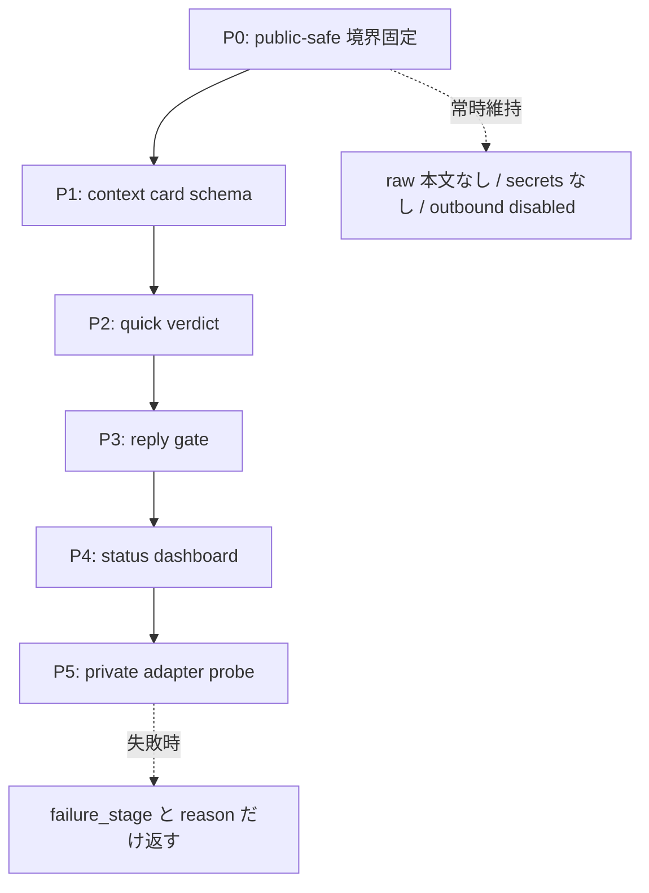

# Discord context bridge roadmap

## 目的

Discord をほぼ開かずに、こちら側でスレッド文脈・参加者・ルール・返信前ゲートを扱える MVP を作る。これは単なる本文取得ツールではなく、Discord コミュニケーションのガイドである。送信・削除・reaction・外部投稿は別 stopline とし、この repo の既定は read-only / public-safe に保つ。

## MVP 優先順位

5PR 目処の薄い切り方は、先に blocker を出す順に並べる。各 PR は `fixture + smoke + public-safe leak check` を最低条件にする。

| PR | 主目的 | blocker として先に見ること | smoke / preflight |
|---|---|---|---|
| 1 | README / ROADMAP の可視化 | 目的、境界、順序が読み手に伝わるか | Markdown diff、secret / raw text grep |
| 2 | private adapter probe の実機経路 | no-focus で取れるか、権限で止まるか | fixture probe、実機 probe、failure_stage |
| 3 | context card 自動更新 | 差分検知と保存境界が崩れないか | watch-passport、store audit |
| 4 | 返信前ゲート | 速い会話で過剰 gate にならないか | review-draft fixture、risk-based verdict |
| 5 | 運用 UI / ログ | ユーザーが今の状態を一目で把握できるか | status-dashboard、raw text omitted check |

## Core intent

- ユーザーは Discord アプリを起動しておくが、基本的には Discord 画面を見ない。
- bridge 側で「あ、面白そう」「関係ありそう」「今は待ち」を 1-3 秒で出す。
- 勢いで入る価値がある場面では、長い gate で熱量を殺さない。
- 文脈違い、ルール違い、相手を傷つける、TPO 違いは出す前に止める。
- AI は作文代行ではなく supporter / OS。本人の意見や勢いを残し、整形・差分説明・文脈チェック・危険検出を担う。
- ASD / ADHD 傾向、反射的参加、イライラ、空気やルールの読み落としを支援対象に含める。

## A. 実 Discord 本文取得 / 実運用保証

- `adapter_failed` は `failure_stage` へ分類する: `dependency_missing`, `capture_failed`, `ocr_empty`, `parse_empty`, `min_parsed_failed`, `timeout`, `permission`, `unsupported_screen_state`。
- `timeout` は `source_stage` へ分解する: `window_list_timeout`, `full_scan_timeout`, `source_command_timeout`, `system_events_timeout`。process/window の未検出は `process_not_found` / `window_not_found` として返す。
- `scripts/private_adapter_probe.py` と `scripts/live_ops_smoke.py` は raw 本文を出さず、human-safe `reason`, `source_ready`, `gate_verdict`, `text_output=omitted`, `outbound_actions=disabled` を返す。
- `scripts/live_mvp_status.py` は preflight -> live smoke -> ops check を順番実行し、raw 本文、参加者名、store path を出さず実運用MVP状態を返す。
- `scripts/ops_preflight.py` は依存コマンド、Discord process/window、private adapter 設定だけを確認し、本文は読まない。
- `scripts/e2e_private_adapter_check.py` は private adapter probe -> live smoke を temp store で順番実行する。
- `scripts/discord_bot_route_preflight.py` は `@discord` bot route の token有無、policy、allow/group/pending件数だけを返し、token値や snowflake値は出さない。
- private adapter 契約は stdout/module の text contract だけにする。token, cookie, webhook, browser profile は受け取らない。
- OCR / ScreenCapture profile は region 必須、full-screen capture 禁止、text output omitted、outbound disabled を維持する。
- 実機 probe の成功条件は `parsed >= 1`, `source_ready=true`, `gate_verdict=pass`, `text_output=omitted`, `outbound_actions=disabled`。
- fixture で parser/gate を保証し、実機 probe で capture/OCR path を保証する。
- no-focus route と focus-required route を分ける。no-focus が無理な場合は JSON の `failure_stage` / `reason` で返す。
- raw OCR 本文、参加者名、secret-like 文字列を README / PR / log / visible JSON に出さない smoke を維持する。

## B. 文脈カード / 返信前ゲート MVP

- P1 MVP は context card schema、quick verdict、status dashboard command の 3 点を先に固定する。
- context card は thread 目的、直近話題、参加者ロール、暗黙/明示ルール、NG 寄り行動、入ってよい流れ、速度感を持つ。
- context card には、サーバールール、チャンネルルール、スレッド固有ルール、元の話題からのズレ、参加者の温度感、見落とし前提、返信前に確認すべき一点を入れる。
- context card は raw 本文や実参加者名を出さず、安全 label / role / 要約だけで作る。
- ルール紐付けはまず手動登録 + thread key 紐付けで始める。
- 返信前ゲートは draft を受け取り、`context_fit`, `tone_risk`, `rule_risk`, `missing_premise`, `urgency` を判定する。
- 自動送信は後回し。MVP は copy/paste 前提とし、send automation は別 stopline。
- thread policy は `momentum_ok` と `cushion_required` を分ける。
- quick verdict は `go`, `wait`, `ask-context`, `risky` の 4 値にする。
- review depth は risk-based にする。quick glance は 1-3 秒、deep review は返信前や怪しい時だけ使う。
- 出力は短くする: 「問題なさそう」「ここだけズレ」「今は待ち」「こういう意味ですよね？」。

## C. 失速防止

- context budget meter は長いチャットで handoff packet を促す。
- handoff packet は現在地、merge 済み PR、未完了、次の 1 手、実行コマンド、stopline、residual を固定形式にする。
- initial size probe は対象 file 数、論点数、tool 数、実装 + 検証、Type1 境界、subagent 要否を見る。
- orchestration checklist は roadmap -> worktree -> smoke/preflight -> bounded sidecar -> integration -> PR -> merge -> residual cleanup。
- status command は動いているもの、動いていないもの、local state、PR state、residual を日本語 JSON/Markdown で返す。
- GitHub auth preflight は `gh auth user`, remote permission, branch delete permission, PR create/merge permission を事前確認する。
- README / PR / docs / CLI human output は日本語を既定にする。
- public-safe path mask は local username、Discord 本文、参加者名、secret-like 文字列を visible output から消す。
- status dashboard command は raw 本文、参加者名、secret、local path を出さず、`now / done / broken / blocked / next / github / residual` だけを短く返す。

## 運用フェーズ図

| フェーズ | 入口 | 出力 | 完了条件 |
|---|---|---|---|
| 取得確認 | private adapter / fixture | 件数、失敗 stage、safe reason | raw 本文を表示せず `parsed >= 1` または理由つき停止 |
| 文脈化 | 可視テキスト + 明示文脈 | context card / passport | 実 ID ではなく safe label / role / 要約で説明できる |
| 返信前確認 | draft + 直近文脈 | quick verdict / risk | 送信せず、人間が判断できる短い指摘になる |
| 運用確認 | smoke / status command | `now / done / broken / blocked / next` | secret、local path、参加者名、raw 本文を出さない |
| 引き継ぎ | handoff packet | 次の一手、stopline、residual | PR / 外部共有前に境界が再確認されている |

## Stopline

- Discord send、auto reply、reaction、delete は明示 GO まで禁止する。
- Git push、PR 公開、外部投稿、外部共有は main agent / human gate の担当で、この repo の自動コマンドには含めない。
- raw 本文、実参加者名、secret、token、cookie、webhook URL、browser profile、local username、local filesystem path を README / PR / log / JSON / CLI human output に出さない。
- この repo の既定は read-only / local-first / public-safe とする。

## D. 8 item roadmap

1. 画面 / スレッド選択
2. 差分検知
3. 文脈カード自動更新
4. ルール紐付け
5. 返信前ゲート
6. 下書きレビュー
7. 運用 UI / ログ表示
8. GitHub / residual / blocker status

## Meta features

- Context Budget Gate: 肥大化したら要約ではなく実装可能な handoff packet を作る。
- User Intent Memory: 目的を「文脈把握 + 返信前支援」と固定し、本文取得だけに縮退しない。
- Thin MVP Slicer: 常に次に実機で試せる最小単位へ切る。
- Real-Test First Loop: fixture だけで満足せず、実機 probe で次 blocker を出す。
- Safe Output Gate: raw 本文、参加者名、secret、local path を出さない。
- Japanese Output Guard: README / PR / CLI 人間向け出力 / 最終報告は日本語を既定にする。
- Status Dashboard Command: `now / done / broken / blocked / next` を 1 command で返す。
- Auth / GitHub Preflight: gh account、権限、branch delete、PR 権限を先に見る。
- Orchestration Router: 2 file 以上、複数論点、実装 + 検証なら sidecar / worktree を検討する。
- Handoff Template: 現在地、目的、実装済み、未完了、次の一手、stopline、検証コマンド、GitHub 状態を固定形式にする。
