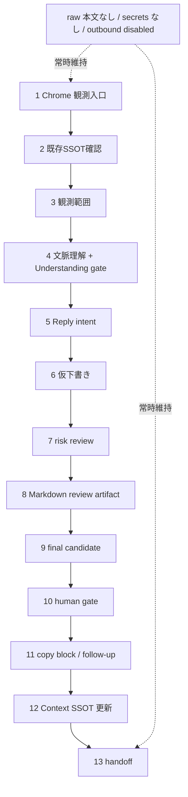
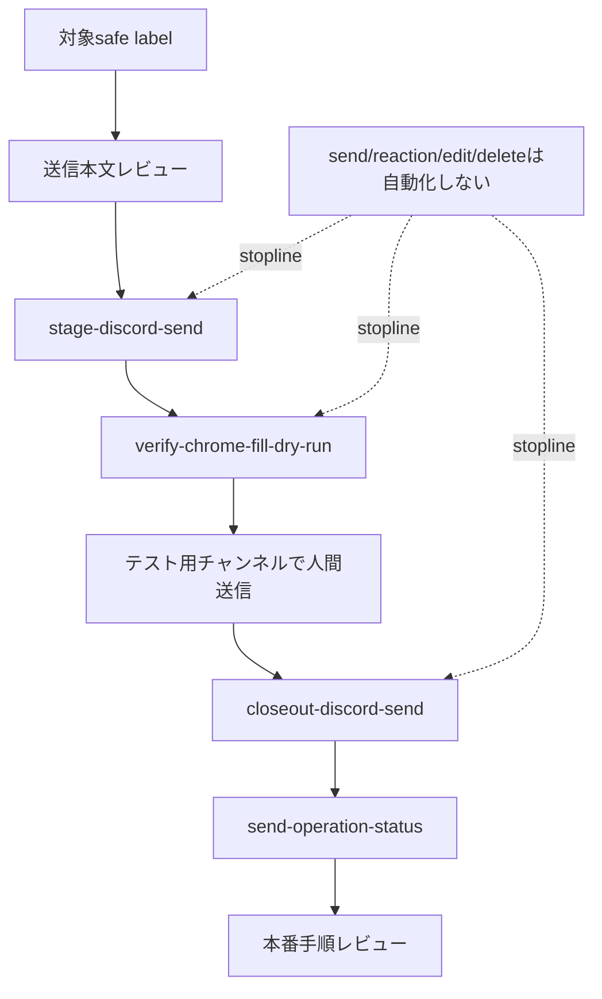

# Discord context bridge roadmap

## 目的

Discord をほぼ開かずに、こちら側でスレッド文脈・参加者・ルール・返信前ゲートを扱える MVP を作る。これは単なる本文取得ツールではなく、Discord コミュニケーションのガイドである。送信・削除・reaction・外部投稿は別 stopline とし、この repo の既定は read-only / public-safe に保つ。

## MVP 優先順位

MVP の判断正本は `references/initial-thread-ruleset.md` の13工程です。
CLI、MCP、plugin、ChatGPT connector、実機 capture は必要な時だけ使う任意
adapter / developer verification であり、MVP の成立条件にはしません。

ADR 0001 により、draft は理解確認後にだけ作ります。観測、SSOT確認、
rules / pin 照合、理解サマリ、人間の `understanding-ok` を通るまで、
reply draft、final candidate、copy block は作りません。

薄い切り方は13工程を前から順に通す。各PRは `fixture smoke + preflight + public-safe leak check` を最低条件にする。実機 capture は13工程E2Eが通ってから任意 adapter として足す。

| PR | 主目的 | blocker として先に見ること | smoke / preflight |
|---|---|---|---|
| 1 | 13工程SSOTと可視化 | MVPの正本とMVP外が読めるか | Markdown diff、secret / raw text grep |
| 2 | Markdown review artifact skeleton | 4-7工程を1つの作業ファイルに落とせるか | fixture -> review artifact smoke |
| 3 | human gate と copy block | 8-10工程で送信せず人間判断へ止まるか | final candidate / copy block fixture |
| 4 | Context SSOT update と handoff | 12-13工程で閉じられるか | temp SSOT update / handoff packet smoke |
| 5 | 13工程E2E | 1-13工程をfixtureで最後まで通せるか | fixture E2E、public-safe leak check |

## MVP done 条件

MVP done は、次をすべて満たす状態です。

- 13工程が1本の fixture E2E で通る。
- 主出力は Markdown review artifact であり、人間が読んで直接編集できる。
- final candidate と copy block は作るが、Discord send / reaction / edit / delete はしない。
- Context SSOT update と handoff packet まで到達する。
- CLI / MCP / plugin / ChatGPT connector / live capture は任意 adapter のまま、MVP必須経路にしない。
- `python -m pytest tests -q`、`python -m compileall src tests scripts`、`scripts/bump_version.py --check`、public-safe grep が green。
- release 前の version は `scripts/bump_version.py --part patch|minor|major --write` で採番し、`pyproject.toml` と `CHANGELOG.md` を同時更新する。

## 次フェーズ: 送信テスト運転表

MVP後の送信テストは、Discord自動送信の実装ではなく、人間送信の前後を安全に閉じる運転表として扱います。

| 項目 | 現状 | 残TODO |
|---|---|---|
| 対象チャンネル/投稿先の明示 | `target-label` でsafe label化 | 実テスト対象のsafe labelを決める |
| 送信本文レビュー | `review-draft` / `stage-discord-send` | 実チャンネル文脈で確認する |
| dry-run / preview | `verify-chrome-fill-dry-run` | Chrome拡張実環境の観測ログを残す |
| テスト用チャンネルで実送信 | 人間送信後closeoutの受け口あり | テストチャンネルで実送信してcloseoutする |
| 送信ログ/失敗時回復 | `send-operation-status` に吸い上げ可能 | 修正投稿/停止/再送の回復方針をレビュー済みにする |
| 本番送信手順固定 | `docs/discord-send-operation-runbook.md` | 本番前チェックリストとして運用する |

## 13工程の受け入れマトリクス

| # | 工程 | done condition | smoke | preflight | E2E |
|---|---|---|---|---|---|
| 1 | Chrome 観測入口 | URL/title/channel label/source readiness を safe metadata として扱える | fixture entry metadata | token/cookie/profile を読まない | E2Eの入口metadataになる |
| 2 | 既存SSOT registry 確認 | thread key で既存/新規/stale を分ける | temp registry lookup | local path を表示しない | E2Eで registry state を記録 |
| 3 | 観測・資料取得範囲 | rule/pin/直近/添付/link の必要範囲を列挙する | fixture scope plan | 取得不能を missing_context にする | E2Eで read scope を artifact に入れる |
| 4 | 文脈理解 + Understanding gate | 3-8要点で確定/推定/未確認を分け、人間が確認する | fixture understanding summary | raw 本文を出さず、draft / copy も出さない | `understanding-ok` が draft の前提 |
| 5 | Reply intent | 返信目的と役割を限定する | intent fixture | 引き受けすぎを止める | draft の入力になる |
| 6 | 仮下書きプローブ | 投稿候補ではない provisional draft を作る | draft probe fixture | do_not_post 表示 | understanding-ok 後だけ作る |
| 7 | 下書きリスクレビュー | context/rule/tone/timing/missing premise を判定する | risk review fixture | send/reaction/delete 不可 | artifact のrisk欄になる |
| 8 | Markdown review artifact | 理解、draft、risk、unknown、選択肢を保存する | artifact生成 smoke | private data grep | E2Eの中心成果物 |
| 9 | 最終返信候補 | final candidate を作るが未送信にする | candidate fixture | 長さとtone確認 | human gate の入力になる |
| 10 | 人間判断 gate | copy/修正/追加読み/待機/返信なしを選べる | gate state fixture | 自動送信なし | E2Eで判断stateを残す |
| 11 | コピー可能な出力 / follow-up | copy_block を短く返し、送信後観測は依頼がある時だけ行う | copy block fixture | 3分割以上と自動追撃は止める | E2Eで copy_block / optional follow-up state を残す |
| 12 | Context SSOT 更新 | safe metadata と判断結果を registry に保存する | temp SSOT write | raw/private path を保存しない | E2Eで更新確認 |
| 13 | 終了・handoff | current state/read scope/stopline/next action を返す | handoff fixture | public release artifact にしない | E2Eの終了条件 |

## Core intent

- ユーザーは Discord アプリを起動しておくが、基本的には Discord 画面を見ない。
- bridge 側で「あ、面白そう」「関係ありそう」「今は待ち」を 1-3 秒で出す。
- 勢いで入る価値がある場面では、長い gate で熱量を殺さない。
- 文脈違い、ルール違い、相手を傷つける、TPO 違いは出す前に止める。
- AI は作文代行ではなく supporter / OS。本人の意見や勢いを残し、整形・差分説明・文脈チェック・危険検出を担う。
- ASD / ADHD 傾向、反射的参加、イライラ、空気やルールの読み落としを支援対象に含める。

## A. Freeze / backlog: 実 Discord 本文取得

次は13工程MVPの後で検討する任意 adapter / developer verification です。
MVP done の blocker にはしません。

- `adapter_failed` は `failure_stage` へ分類する: `dependency_missing`, `capture_failed`, `ocr_empty`, `parse_empty`, `min_parsed_failed`, `timeout`, `permission`, `unsupported_screen_state`。
- `timeout` は `source_stage` へ分解する: `window_list_timeout`, `full_scan_timeout`, `source_command_timeout`, `system_events_timeout`。process/window の未検出は `process_not_found` / `window_not_found` として返す。
- `scripts/private_adapter_probe.py` と `scripts/live_ops_smoke.py` は raw 本文を出さず、human-safe `reason`, `source_ready`, `gate_verdict`, `text_output=omitted`, `outbound_actions=disabled` を返す。
- `scripts/live_mvp_status.py` は preflight -> live smoke -> ops check を順番実行し、raw 本文、参加者名、store path を出さず実運用MVP状態を返す。
- `scripts/live_mvp_status.py` と `scripts/ops_preflight.py` は `macos-screencapture-region` を直接受け取り、環境変数なしで region OCR route を確認できる。
- `scripts/ops_preflight.py` は依存コマンド、Discord process/window、private adapter 設定だけを確認し、本文は読まない。
- `scripts/e2e_private_adapter_check.py` は private adapter probe -> live smoke を temp store で順番実行する。
- `scripts/discord_bot_route_preflight.py` は `@discord` bot route の token有無、policy、allow/group/pending件数だけを返し、token値や snowflake値は出さない。
- private adapter 契約は stdout/module の text contract だけにする。token, cookie, webhook, browser profile は受け取らない。
- OCR / ScreenCapture profile は region 必須、full-screen capture 禁止、text output omitted、outbound disabled を維持する。
- 実機 probe の成功条件は `parsed >= 1`, `source_ready=true`, `gate_verdict=pass`, `text_output=omitted`, `outbound_actions=disabled`。
- fixture で13工程の parser/gate を保証し、実機 probe は capture/OCR path の任意確認に限定する。
- no-focus route と focus-required route を分ける。no-focus が無理な場合は JSON の `failure_stage` / `reason` で返す。
- raw OCR 本文、参加者名、secret-like 文字列を README / PR / log / visible JSON に出さない smoke を維持する。

## B. 初期13工程 MVP

- P1 MVP は `references/initial-thread-ruleset.md` の 13 工程を先に固定する。
- context card schema、quick verdict、status dashboard command は13工程を支える内部部品として扱う。
- context card は thread 目的、直近話題、参加者ロール、暗黙/明示ルール、NG 寄り行動、入ってよい流れ、速度感を持つ。
- context card には、サーバールール、チャンネルルール、スレッド固有ルール、元の話題からのズレ、参加者の温度感、見落とし前提、返信前に確認すべき一点を入れる。
- context card は raw 本文や実参加者名を出さず、安全 label / role / 要約だけで作る。
- ルール紐付けはまず手動登録 + thread key 紐付けで始める。
- 返信前ゲートは draft を受け取り、`context_fit`, `tone_risk`, `rule_risk`, `missing_premise`, `urgency` を判定する。
- 自動送信は後回し。MVP は copy/paste 前提とし、send automation は別 stopline。
- thread policy は `momentum_ok` と `cushion_required` を分ける。
- quick verdict は `go`, `wait`, `ask-context`, `risky` の 4 値にする。
- `review-draft` / `guide-reply` は `quick_verdict` と `one_check_before_reply` を返し、勢いを止めすぎず危険時だけ短く止める。
- review depth は risk-based にする。quick glance は 1-3 秒、deep review は返信前や怪しい時だけ使う。
- 出力は短くする: 「問題なさそう」「ここだけズレ」「今は待ち」「こういう意味ですよね？」。

## C. 失速防止

- context budget meter は長いチャットで handoff packet を促す。MVP では13工程の終了条件として扱う。
- handoff packet は現在地、実装済み、未導入、次の 1 手、stopline、未解決事項を固定形式にする。
- initial size probe は対象 file 数、論点数、tool 数、実装 + 検証、Type1 境界、subagent 要否を見る。
- orchestration checklist は roadmap -> worktree -> smoke/preflight -> bounded sidecar -> integration -> PR -> merge -> residual cleanup。
- status command は動いているもの、動いていないもの、local state、PR state、residual を日本語 JSON/Markdown で返す。
- GitHub auth preflight は `gh auth user`, remote permission, branch delete permission, PR create/merge permission を事前確認する。
- README / PR / docs / developer smoke output は日本語を既定にする。
- public-safe path mask は local username、Discord 本文、参加者名、secret-like 文字列を visible output から消す。
- status dashboard command は raw 本文、参加者名、secret、local path を出さず、`now / done / broken / blocked / next / github / residual` だけを短く返す。

## 運用フェーズ図

| フェーズ | 入口 | 出力 | 完了条件 |
|---|---|---|---|
| 入口確認 | safe metadata / fixture | URL、title、channel label、source readiness | raw 本文を表示せず入口状態を説明できる |
| 文脈化 | 可視テキスト + 明示文脈 | context card / passport | 実 ID ではなく safe label / role / 要約で説明できる |
| 返信前確認 | draft + 直近文脈 | Markdown review artifact / risk | 送信せず、人間が判断できる短い指摘になる |
| 運用確認 | smoke / preflight / fixture E2E | `now / done / broken / blocked / next` | secret、local path、参加者名、raw 本文を出さない |
| 引き継ぎ | handoff packet | 次の一手、stopline、residual | PR / 外部共有前に境界が再確認されている |

## Stopline

- Discord send、auto reply、reaction、delete は明示 GO まで禁止する。
- Git push、PR 公開、外部投稿、外部共有は main agent / human gate の担当で、この repo の自動コマンドには含めない。
- raw 本文、実参加者名、secret、token、cookie、webhook URL、browser profile、local username、local filesystem path を README / PR / log / JSON / developer smoke output に出さない。
- この repo の既定は read-only / local-first / public-safe とする。

## D. 13 item implementation roadmap

1. Chrome 観測入口
2. 既存SSOT registry 確認
3. 観測・資料取得範囲
4. 文脈理解チェック
5. 仮下書きプローブ
6. 下書きリスクレビュー
7. Markdown review artifact
8. 最終返信候補
9. 人間判断 gate
10. コピー可能な出力
11. 送信後観測
12. Context SSOT 更新
13. 終了・handoff

## Meta features

- Context Budget Gate: 肥大化したら要約ではなく実装可能な handoff packet を作る。
- User Intent Memory: 目的を「文脈把握 + 返信前支援」と固定し、本文取得だけに縮退しない。
- Thin MVP Slicer: 常に13工程の次工程を実装できる最小単位へ切る。
- Fixture-First Public Core Loop: smoke / preflight / fixture E2E で先に public core を固める。
- Safe Output Gate: raw 本文、参加者名、secret、local path を出さない。
- Japanese Output Guard: README / PR / developer smoke output / 最終報告は日本語を既定にする。
- Status Dashboard Command: `now / done / broken / blocked / next` を 1 command で返す。
- Auth / GitHub Preflight: gh account、権限、branch delete、PR 権限を先に見る。
- Orchestration Router: 2 file 以上、複数論点、実装 + 検証なら sidecar / worktree を検討する。
- Handoff Template: 現在地、目的、実装済み、未完了、次の一手、stopline、検証コマンド、GitHub 状態を固定形式にする。
