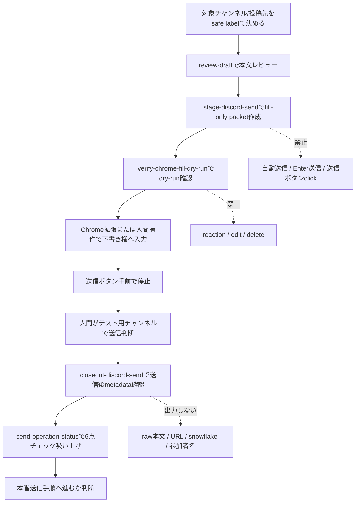
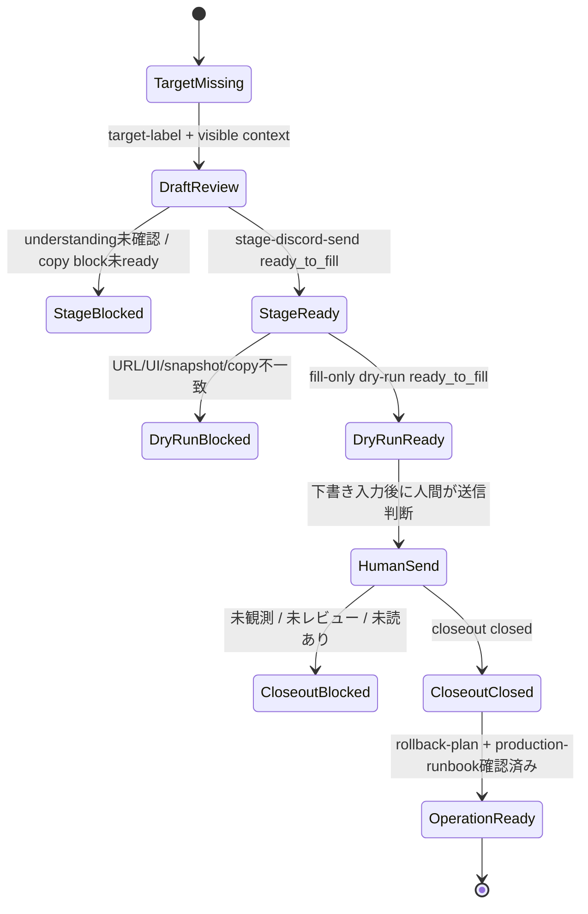

# Discord送信テスト運転表

このrunbookは、Discord Context Bridgeを「人間が送信する直前まで支える」ための手順です。
このリポ自体はDiscordへ送信しません。送信ボタン、Enter送信、reaction、edit、deleteは人間操作です。

## すぐ使う手順



1. 対象チャンネル/投稿先を決める
   - 実URLやsnowflakeを公開ログに出さず、`test-channel` のようなsafe labelで扱います。

2. 送信本文をレビューする

```bash
PYTHONPATH=src python3 -m discord_context_bridge.cli \
  --store .local/discord-context-bridge/events.ndjson \
  review-draft \
  --understanding-confirmed \
  --draft "まず前提を確認してから返事します。" \
  --json
```

3. 下書き入力用packetを作る

```bash
PYTHONPATH=src python3 -m discord_context_bridge.cli \
  --store .local/discord-context-bridge/events.ndjson \
  stage-discord-send \
  --mode reply \
  --target-url "https://discord.com/channels/<guild>/<channel>/<message>" \
  --understanding-confirmed \
  --draft "まず前提を確認してから返事します。" \
  --json > .local/discord-context-bridge/staging-packet.json
```

4. dry-run / previewを通す

```bash
PYTHONPATH=src python3 -m discord_context_bridge.cli \
  verify-chrome-fill-dry-run \
  --staging-packet .local/discord-context-bridge/staging-packet.json \
  --socket-preflight \
  --target-url-verified \
  --socket-after-navigation \
  --latest-target-snapshot-confirmed \
  --reply-ui-candidates 1 \
  --draft-matches-copy-block \
  --socket-pre-send \
  --json > .local/discord-context-bridge/fill-dry-run.json
```

5. テスト用チャンネルで人間が送信する
   - このリポは送信しません。
   - Chrome拡張や人間操作で下書き欄に入れたあと、最後の送信だけ人間が判断します。

6. 送信後closeoutを取る

```bash
PYTHONPATH=src python3 -m discord_context_bridge.cli \
  closeout-discord-send \
  --staging-packet .local/discord-context-bridge/staging-packet.json \
  --dry-run-report .local/discord-context-bridge/fill-dry-run.json \
  --human-sent-observed \
  --human-reviewed \
  --observed-text-status human-edited-and-reviewed \
  --unread-check-status none-unread \
  --observed-message-id "<message-id>" \
  --json > .local/discord-context-bridge/send-closeout.json
```

7. 既存ログから運転表を吸い上げる

```bash
PYTHONPATH=src python3 -m discord_context_bridge.cli \
  send-operation-status \
  --staging-packet .local/discord-context-bridge/staging-packet.json \
  --dry-run-report .local/discord-context-bridge/fill-dry-run.json \
  --closeout-report .local/discord-context-bridge/send-closeout.json \
  --target-label test-channel \
  --rollback-plan-reviewed \
  --production-runbook-fixed \
  --json
```

## 6点チェック

| チェック | OK条件 | 足りない時 |
|---|---|---|
| 対象チャンネル/投稿先の明示 | `target-label` と staging packet がある | safe labelを決める |
| 送信本文のレビュー | `stage-discord-send` が `ready_to_fill` | review-draft / understanding gateを通す |
| dry-run / preview | `verify-chrome-fill-dry-run` が `ready_to_fill` | URL、UI候補数、snapshot、copy block一致を直す |
| テスト用チャンネルで実送信 | 人間送信後のcloseoutが `closed` | テストチャンネルで人間が送信し、観測する |
| 送信ログ/失敗時回復確認 | closeout、未読0、回復手順レビュー済み | 修正投稿、停止、人間確認の手順を確認する |
| 本番送信手順の固定化 | runbookをレビュー済みにする | 本番前チェックリストを更新する |

## 現状ロジック



## 失敗時の扱い

- 誤送信の自動削除やeditはしません。
- 失敗時は、人間が対象チャンネルを見て、停止、修正投稿、再送、追記説明のどれにするか決めます。
- このリポが残すのはmetadata-onlyの状態です。本文、URL、snowflake、参加者名は出力しません。

## 本番前の最低条件

本番チャンネルで送信する前に、次をすべて満たします。

- `send-operation-status` が `ok: true`
- テストチャンネルでcloseout済み
- 本文は人間レビュー済み
- 送信先safe labelが明示されている
- 失敗時の回復方針が確認済み
- Discord送信は人間が最後に実行する
