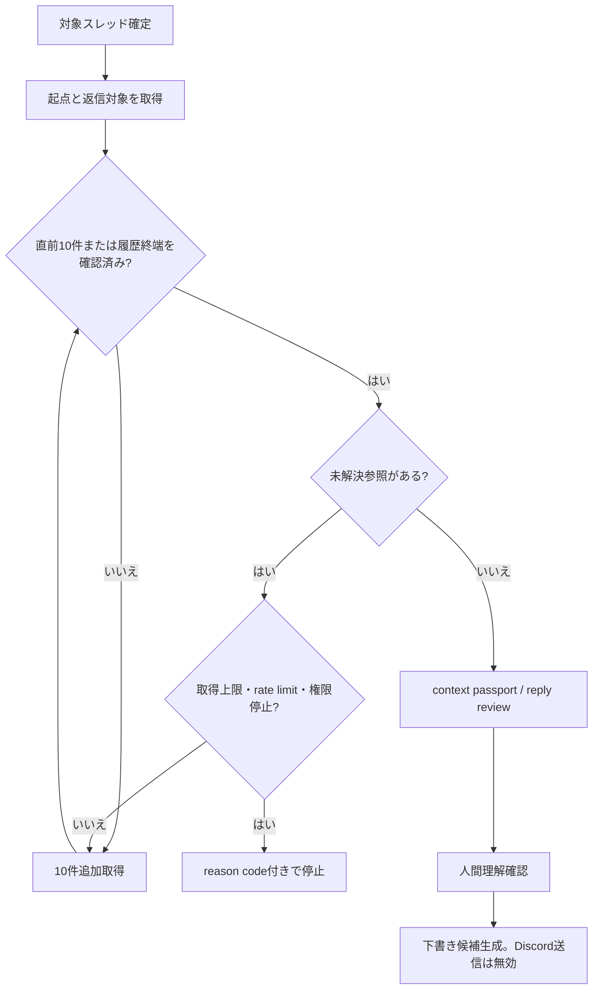

# 返信前文脈ルーティング

Discord Context Bridge が返信候補を作る前に、最低限必要な会話範囲と追加取得条件を判定する仕組みです。

## 目的

本文を1件取得しただけで返信候補へ進むことを防ぎます。取得層と返信生成層の間に fail-closed の gate を置き、必要文脈が揃わない時は生成せず、人間が理解できる停止理由と次の取得量を返します。

## 必須条件

- スレッド起点を取得済みである。
- 返信対象を取得済みである。
- 返信対象までの直前10件を取得済みである。
- 指示語、引用、添付、過去回答などの未解決参照がない。

スレッド全履歴が10件未満の場合は、履歴終端を確認したうえで取得可能な全件を使います。

## 状態遷移



## 状態と次の動作

| state | 意味 | 次の動作 |
|---|---|---|
| `ready` | 起点・対象・直前10件・参照解決を確認済み | 返信レビューへ進む |
| `ready_short_thread` | 全履歴が10件未満で、履歴終端と全件取得を確認済み | 返信レビューへ進む |
| `expand_required` | 件数不足または未解決参照あり | `next_fetch_limit` まで追加取得する |
| `blocked` | 起点・対象欠落、取得上限、認証、権限、rate limit等 | reason codeを人間語へ変換して停止する |

## システム境界

取得層はメッセージ本文と関係情報をprivate local artifactへ保存します。public coreは本文を返さず、起点・対象の有無、件数、未解決参照数、状態、reason codeだけを扱います。

visible textを平坦化しただけでは、スレッド起点や返信関係を証明できません。structured `messages[]` は `is_thread_root`、`is_reply_target`、必要に応じて `unresolved_reference` を保持します。取得adapterが関係情報を提供できない場合は `thread_root_missing` または `reply_target_missing` で停止します。

Discordへの送信、reaction、edit、deleteはこの経路に含みません。返信候補が生成できても `outbound_actions=disabled` と `send_capability=disabled` を維持します。

## 保証範囲

保証するもの:

- CLIとMCPの返信入口が最低文脈gateを通ること。
- 条件不足時にfinal candidateとcopy blockを生成しないこと。
- 10件刻みの追加取得量と停止理由をmetadata-onlyで返すこと。
- raw本文、参加者名、実IDをpublic出力へ出さないこと。
- runtime skill生成物と運用契約が同じ条件を持つこと。

外部条件として保証できないもの:

- Discord APIやChrome adapterへ常に接続できること。
- bot/userに対象履歴を読む権限があること。
- rate limitが発生しないこと。
- 削除済みメッセージや取得不能な添付が復元できること。

外部条件で失敗した場合は成功扱いにせず、取得済み範囲、原因、再開条件を返すところまでを運用保証とします。

## 確認コマンド

```bash
PYTHONPATH=src python3 -m discord_context_bridge.cli \
  reply-context-plan \
  --thread-root-present \
  --reply-target-present \
  --prior-message-count 10 \
  --json

python3 -m pytest tests -q
python3 scripts/verify_ssot_projection.py --json
python3 scripts/lint_ingest_route_policy.py --json
python3 scripts/ops_check.py --gh
```
